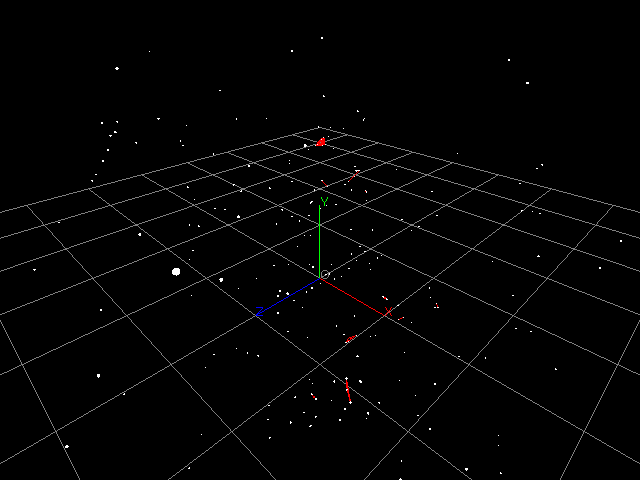

# Next Unit Engine



## これは何？

これは（仮説として）標準模型よりも小さい単一の物質「mono」と作用「effect」を独自で研究するために作成した、C++とOpenGLで動作する3Dシミュレーターです。

## 使用言語

C++ 26 (コンパイルはGNU Compiler Collection: GCC、フォーマットはClang-Formatを使用)

## 使用ライブラリー

- cmath
- freeglut (OpenGL Utility Toolkit: GLUT)

## 使用方法

makeでソースコードから実行ファイルを生成します。GCC以外のコンパイラーを使用する場合やライブラリーの専用パスを指定する場合は、Makefileを編集するか、個別にコマンドを実行します。

```sh:Bash
make
```

第1引数に世界の初期状態を記述したテキストファイル「NUE Unplayed Epilogue: NUE」のパスを指定して実行します。

```sh:Bash
./obj/NextUnitEngine world.nue
```

## NUEファイル

実行ファイルはNUEファイルを読み取り、世界にmonoを設置します。基本的な書式は以下の通りです。各テンプレートの変数については[TEMPLATE.md](./TEMPLATE.md)を参照してください。

```plaintext:sample.nue
#<comment: something>

@<template_name: string>
    origin: <x: double>, <y: double>, <z: double>
    force: <x: double>, <y: double>, <z: double>
    origin-noise: <v: double>
    force-noise: <v: double>
    <option_property: string>: <option_value: something>
    ...

@<template_name: string>
    ...
```
